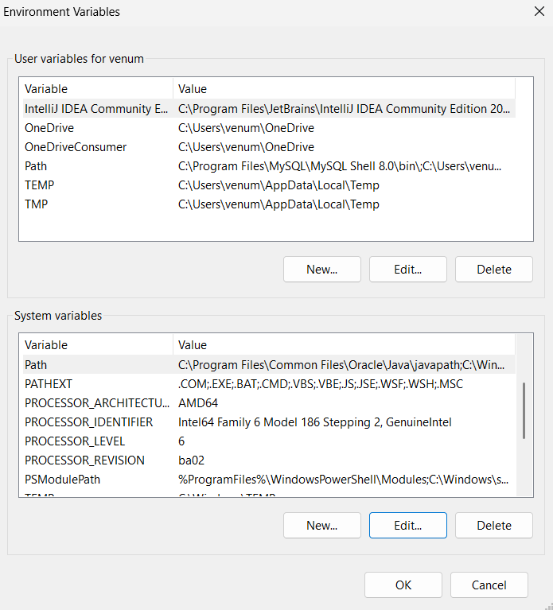
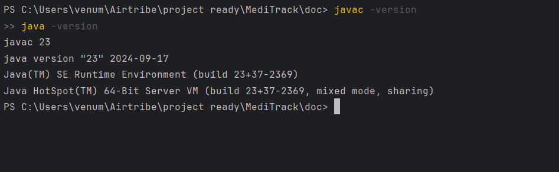

# Setup Instructions

## Overview
Java is a high-level, object-oriented programming language used to build web apps, mobile applications, and enterprise software systems.

---

## Installation Steps
1. **Download Java Development Kit (JDK)**:
   - Go to the [Oracle JDK download page](https://www.oracle.com/java/technologies/javase-jdk21-downloads.html).
   - Select the appropriate version for your operating system (Windows, macOS, or Linux) and download it.

2. **Install JDK**:
   - Run the downloaded installer and follow the on-screen instructions to complete the installation.
   - Make sure to note the installation path (e.g., `C:\Program Files\Java\jdk-21` on Windows).
   - During installation, ensure that the option to set the `JAVA_HOME` environment variable is selected.
   
    **Refer the image for environment variable setup:**
    
   
3. **Verify Installation**:
   - Open a terminal or command prompt and run the following commands to verify that Java is installed correctly:
     ```bash
     java -version
     javac -version
     ```
   - You should see output indicating the installed Java version.
    
   
